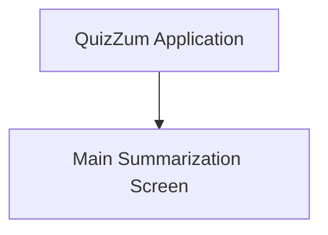

# QuizZum UI/UX Specification

## Introduction

This document defines the user experience goals, information architecture, user flows, and visual design specifications for QuizZum's user interface. It serves as the foundation for visual design and frontend development, ensuring a cohesive and user-centered experience.

## Overall UX Goals & Principles

### Target User Personas
*   **Overwhelmed Student:**
    *   **Demographic Profile:** Students (high school, college, university) across various disciplines.
    *   **Needs & Pain Points:** Struggles with organizing and synthesizing large volumes of information, experiences cognitive overload, procrastinates due to perceived difficulty, needs simplified explanations and engaging study tools.
    *   **Goals:** Improve understanding and retention, study efficiently, reduce stress, make learning enjoyable, achieve better academic performance.

### Usability Goals
*   **Ease of learning:** New users can easily understand how to input text and generate summaries.
*   **Efficiency of use:** Users can quickly generate and switch between different summary levels.
*   **Clarity:** The interface clearly communicates what is happening (e.g., loading states, active summary level).
*   **Engagement:** The overall experience should be intuitive and encourage regular use.

### Design Principles
1.  **Simplicity:** Minimize "noise" and complex choices, providing a frictionless user experience.
2.  **Intuition:** The interface should be easy to understand and navigate without extensive instructions.
3.  **Engagement:** Transform passive learning into an active, "playable" experience.
4.  **Feedback:** Provide clear and immediate visual feedback for all user actions (e.g., button states, loading indicators).
5.  **Consistency:** Use familiar UI patterns and consistent visual elements throughout the application.

### Change Log
| Date       | Version | Description               | Author |
| :--------- | :------ | :------------------------ | :----- |
| 2025-12-02 | 1.0     | Initial UI/UX Specification | Gemini |

## Information Architecture (IA)

### Site Map / Screen Inventory

*(This MVP focuses on a single primary screen for the core summarization functionality.)*

### Navigation Structure
**Primary Navigation:** Not applicable for MVP (single screen).
**Secondary Navigation:** Not applicable for MVP (single screen).
**Breadcrumb Strategy:** Not applicable for MVP (single screen).

## User Flows

### Main Flow: Summarization

**User Goal:** To obtain multi-level summaries of lecture notes.

**Entry Points:** Directly accessing the QuizZum web application.

**Success Criteria:** User successfully views all three summary levels (Easy, Medium, Hard) for their input text.

#### Flow Diagram
```mermaid
graph TD
    A[Start: Open QuizZum] --> B{Input Text Area Empty?}
    B -- Yes --> C[Generate Button Disabled]
    B -- No --> D[Generate Button Enabled]
    C --> E[Paste Notes into Text Area]
    E --> D
    D --> F[Select Summary Level (Easy/Medium/Hard)]
    F --> G[Click "Generate Summary" Button]
    G --> H[Loading State: Inputs Disabled, Loading Indicator Displayed]
    H --> I{Backend API Call Completes?}
    I -- Yes --> J[Summaries Displayed: Tabs for Easy/Medium/Hard]
    J --> K[User Switches Between Summary Tabs]
    I -- No (Error) --> L[Display Error Message]
```

#### Edge Cases & Error Handling:
*   User clicks "Generate" with empty text area: Button remains disabled (handled by UI).
*   Backend API call fails: Display a generic "Failed to generate summary. Please try again." message to the user. Log detailed error on backend.
*   Network disconnection during generation: Display a "Network error. Please check your connection." message.

#### Notes:
This flow is designed to be as simple and direct as possible for the MVP, focusing on the core value proposition of multi-level summarization.

## Wireframes & Mockups

**Primary Design Files:** For conceptual layouts, please refer to `docs/wireframe.md`. Detailed visual designs (high-fidelity mockups, prototypes) would typically be in an external tool like Figma or Sketch.

### Key Screen Layouts
*   **Main Summarization Screen - Initial State**
    *   **Purpose:** Allow user to input text and configure summary generation.
    *   **Key Elements:**
        - Application Header ("QuizZum")
        - Large, resizable text input area with placeholder.
        - "Easy," "Medium," "Hard" radio buttons/toggles.
        - "Generate Summary" button (initially disabled).
        - Placeholder text for summary output area.
    *   **Interaction Notes:** "Generate Summary" button activates upon text input. Default summary level selected.
    *   **Design File Reference:** `docs/wireframe.md` - "1. Main Screen - Initial State"

*   **Main Summarization Screen - Loading State**
    *   **Purpose:** Provide feedback during summary generation.
    *   **Key Elements:**
        - Application Header ("QuizZum")
        - Disabled text input area.
        - Disabled summary level selector.
        - "Generate Summary" button in loading state (e.g., spinner).
        - Loading indicator (spinner/animation) in output area with optional message.
    *   **Interaction Notes:** No user interaction possible during this state for the input section.
    *   **Design File Reference:** `docs/wireframe.md` - "2. Main Screen - Loading State"

*   **Main Summarization Screen - Summary Display State**
    *   **Purpose:** Present generated summaries and allow dynamic switching.
    *   **Key Elements:**
        - Application Header ("QuizZum")
        - Re-enabled text input area.
        - Re-enabled summary level selector.
        - Re-enabled "Generate Summary" button.
        - Summary content displayed in output area.
        - Tabs ("Easy," "Medium," "Hard") above summary content.
    *   **Interaction Notes:** Clicking tabs instantly changes the displayed summary. User can initiate a new summary.
    *   **Design File Reference:** `docs/wireframe.md` - "3. Main Screen - Summary Display State"

## Component Library / Design System

**Design System Approach:** For the MVP, we will leverage an existing, well-established React component library (e.g., Material UI, Ant Design, or similar) to accelerate development and ensure a baseline level of quality and consistency. A custom design system will be considered post-MVP.

## Branding & Style Guide

### Visual Identity
**Brand Guidelines:** The primary visual identity will be derived from the application name "QuizZum". A clean, modern, and engaging aesthetic is desired to appeal to students.

### Color Palette
*(To be defined based on branding and chosen component library. For MVP, defaults from chosen component library with minor overrides are expected.)*

### Typography
*(To be defined based on chosen component library. Emphasis on readability for academic content.)*

### Iconography
*(To be defined. Icons should be clear and intuitive, supporting the principle of simplicity.)*

### Spacing & Layout
**Grid System:** Responsive grid system for desktop and mobile layouts.
**Spacing Scale:** Consistent spacing scale to ensure visual harmony.

## Accessibility Requirements

### Compliance Target
**Standard:** None (for MVP).
*(As per PRD, explicit WCAG compliance is not a primary focus for the MVP to accelerate development. Basic usability and browser accessibility features are expected. Future phases will consider higher compliance targets.)*

### Key Requirements
**Visual:**
- Color contrast ratios: Basic readability.
- Focus indicators: Default browser focus states.
- Text sizing: Users should be able to resize text via browser functions.

**Interaction:**
- Keyboard navigation: Standard tab navigation through interactive elements.
- Screen reader support: Basic semantic HTML to allow screen readers to interpret content.
- Touch targets: Sufficiently sized interactive elements for touch devices.

**Content:**
- Alternative text: Where images or non-text content are introduced (post-MVP), alt text will be required.
- Heading structure: Semantic heading structure (H1, H2, etc.) for content.
- Form labels: Clearly associated labels for all form inputs.

### Testing Strategy
**Accessibility Testing:** Manual checks for basic usability and screen reader compatibility. Automated accessibility tools will not be a primary focus for MVP.

## Responsiveness Strategy

### Breakpoints
| Breakpoint | Min Width | Max Width | Target Devices        |
| :--------- | :-------- | :-------- | :-------------------- |
| Mobile     | -         | 767px     | Phones                |
| Tablet     | 768px     | 1023px    | Tablets               |
| Desktop    | 1024px    | 1439px    | Laptops, smaller monitors |
| Wide       | 1440px    | -         | Large monitors        |

### Adaptation Patterns
**Layout Changes:**
- **Two-column to stacked layout:** The input and output columns will stack vertically on mobile (input on top, output below).
- **Fluid containers:** Content containers will adjust width based on screen size.

**Navigation Changes:** Not applicable for MVP due to single screen.

**Content Priority:** Input area and generated summary content are always primary.

**Interaction Changes:** Touch-friendly interactions on mobile.

## Animation & Micro-interactions

### Motion Principles
Minimal and purposeful. Animations should enhance user feedback or transitions without causing distraction or delays.

### Key Animations
- **Loading Indicator:** Subtle animation in the output area and/or on the "Generate Summary" button during API calls. (Duration: ~1-2s, Easing: ease-in-out)

## Performance Considerations

### Performance Goals
- **Page Load:** Under 2 seconds (first contentful paint) on a good network.
- **Interaction Response:** UI interactions (button clicks, tab switches) should feel immediate (<100ms).
- **Backend Processing:** Summarization API response within 2-5 seconds (including LLM call, for MVP).

### Design Strategies
- **Lazy Loading:** Not applicable for MVP (single screen).
- **Optimized Assets:** Use optimized images (if any).
- **Efficient UI Rendering:** Leverage React's performance features.
- **Minimal Dependencies:** Keep frontend library footprint small where possible.
- **Server-side Rendering (SSR) / Static Site Generation (SSG):** Not planned for MVP, but a future consideration for faster initial loads.

## Next Steps

### Immediate Actions
1.  Review this UI/UX Specification for completeness and alignment with product vision.
2.  Gather any feedback or required clarifications.

### Design Handoff Checklist
*   All user flows documented (Summarization flow)
*   Component inventory complete (Leveraging external library for MVP)
*   Accessibility requirements defined (MVP: None, basic usability)
*   Responsive strategy clear
*   Brand guidelines incorporated (QuizZum, clean/modern aesthetic)
*   Performance goals established

### Architect Prompt
@architect Based on this UI/UX Specification and the Product Requirements Document (`docs/prd.md`), please create the `fullstack-architecture.md` document. This document should outline the API specifications, data structures, and the concrete integration strategy with the selected LLM, and save it to `docs/fullstack-architecture.md`. Your architecture should support the specified UX goals and functional/non-functional requirements, considering the monorepo structure and chosen technologies (React, FastAPI).
