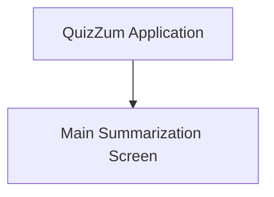

## Information Architecture (IA)
### Site Map / Screen Inventory

*(This MVP focuses on a single primary screen for the core summarization functionality.)*

### Navigation Structure
**Primary Navigation:** Not applicable for MVP (single screen).
**Secondary Navigation:** Not applicable for MVP (single screen).
**Breadcrumb Strategy:** Not applicable for MVP (single screen).