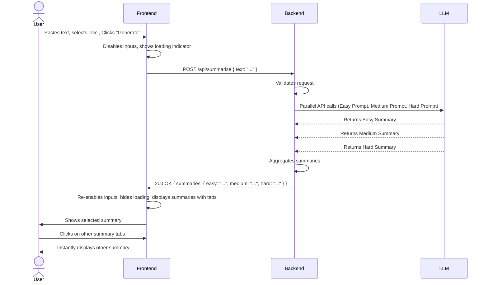
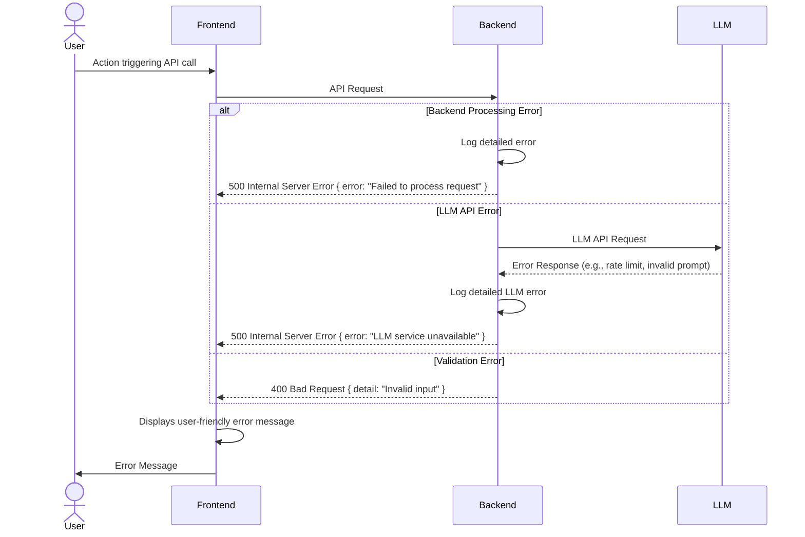

# QuizZum Fullstack Architecture Document

## Introduction

This document outlines the complete fullstack architecture for QuizZum, including backend systems, frontend implementation, and their integration. It serves as the single source of truth for AI-driven development, ensuring consistency across the entire technology stack.

This unified approach combines what would traditionally be separate backend and frontend architecture documents, streamlining the development process for modern fullstack applications where these concerns are increasingly intertwined.

### Starter Template or Existing Project
N/A - Greenfield project with pre-scaffolded frontend (React) and backend (FastAPI) directories. This document defines the architectural approach for integrating and building upon these foundations.

### Change Log
| Date       | Version | Description                 | Author |
| :--------- | :------ | :-------------------------- | :----- |
| 2025-12-02 | 1.0     | Initial Architecture Document | Gemini |

## High Level Architecture

### Technical Summary
QuizZum will be built as a web application utilizing a monorepo structure. The frontend will be developed with React, providing a dynamic and intuitive user interface as specified in the Frontend Specification. The backend will leverage Python with FastAPI, serving a RESTful API to handle summarization requests. A crucial aspect of the architecture is the integration with an external Large Language Model (LLM) for generating multi-level summaries. The system is designed to provide a frictionless user experience, prioritizing fast initial loads and responsive interactions, while supporting future scalability and feature expansion on a major cloud provider.

### Platform and Infrastructure Choice
**Platform:** Cloud-agnostic for MVP, primarily targeting a robust local development environment.
**Key Services:**
*   Frontend: Static file hosting (e.g., Nginx, S3 bucket, Vercel/Netlify for static assets).
*   Backend: Containerized application service (e.g., Docker, Kubernetes, AWS ECS, Azure App Service).
*   External: LLM API provider.
**Deployment Host and Regions:** Initial focus on local development. Cloud provider (AWS, Google Cloud, Azure) and specific regions will be determined post-MVP.

### Repository Structure
**Structure:** Monorepo
**Monorepo Tool:** npm workspaces (for lightweight management of frontend and shared packages, Python backend will reside in a separate directory within the monorepo root).
**Package Organization:**
*   `frontend/`: React application (UI, client-side logic).
*   `backend/`: FastAPI application (API, business logic, LLM integration).
*   `packages/shared/`: (Future consideration for shared types, utilities, e.g., API request/response types).

### High Level Architecture Diagram
```mermaid
graph TD
    User -->|Accesses| Frontend[React App: Web Browser]
    Frontend -->|API Calls (HTTP/S)| Backend[FastAPI App: Python Server]
    Backend -->|LLM API Request| ExternalLLM[External LLM Provider: e.g., Gemini API]
    ExternalLLM -->|LLM API Response| Backend
    Backend -->|API Response| Frontend
```

### Architectural Patterns
-   **Component-Based UI:** React will facilitate a modular and reusable component structure for the frontend, as detailed in the Frontend Specification.
    -   _Rationale:_ Improves maintainability, scalability, and developer collaboration by breaking down complex UIs into manageable, self-contained units.
-   **RESTful API:** The backend will expose a RESTful API for communication with the frontend.
    -   _Rationale:_ Provides a standardized, stateless, and scalable way for different services to communicate, aligning with modern web development practices.
-   **Repository Pattern (for LLM Integration):** The backend's LLM interaction logic will be encapsulated within a dedicated service/repository.
    -   _Rationale:_ Decouples the core business logic from the specific LLM implementation, making it easier to swap LLM providers or update integration details in the future without affecting the rest of the application.

## Tech Stack

### Technology Stack Table
| Category            | Technology       | Version    | Purpose                      | Rationale                                                         |
| :------------------ | :--------------- | :--------- | :--------------------------- | :---------------------------------------------------------------- |
| Frontend Language   | JavaScript       | ES2023+    | Client-side scripting        | Universal, robust ecosystem, strong community support.            |
| Frontend Framework  | React            | ^18.2.0    | UI development               | Declarative, component-based, large ecosystem, good performance.  |
| UI Component Library| Material UI / Ant Design (TBD)| Latest     | UI components                | Accelerate development, ensure consistency and accessibility baseline. |
| State Management    | React Hooks      | ^18.2.0    | Local/global state           | Built-in, sufficient for MVP, aligns with React best practices.   |
| Backend Language    | Python           | ^3.9       | Server-side logic            | Strong for AI/ML, good ecosystem, FastAPI's performance.          |
| Backend Framework   | FastAPI          | ^0.123.4   | Web API                      | High performance, ease of use, automatic docs (OpenAPI).          |
| API Style           | REST             | 1.0        | Frontend-Backend comms       | Standardized, widely understood, stateless.                       |
| Database            | N/A (PostgreSQL post-MVP) | -       | Data storage                 | Not required for MVP. PostgreSQL for future phases (relational, robust). |
| Cache               | N/A              | -          | Performance optimization     | Not required for MVP.                                             |
| File Storage        | N/A              | -          | Storing files                | Not required for MVP.                                             |
| Authentication      | N/A              | -          | User verification            | Not required for MVP.                                             |
| Frontend Testing    | Jest / React Testing Library | Latest     | Unit/Component testing       | Standard for React, good developer experience.                    |
| Backend Testing     | Pytest           | Latest     | Unit/Integration testing     | Python standard, flexible, good ecosystem.                        |
| E2E Testing         | Playwright / Cypress (TBD) | Latest     | End-to-End testing           | Ensures full system functionality (Post-MVP).                     |
| Build Tool          | npm/yarn scripts | Latest     | Project automation           | Standard for JavaScript ecosystem.                                |
| Bundler             | Webpack (via Create React App) | Latest     | Frontend asset bundling      | Standard for React projects.                                      |
| IaC Tool            | N/A              | -          | Infrastructure as Code       | Not required for MVP.                                             |
| CI/CD               | GitHub Actions (TBD) | -          | Continuous Integration/Deployment | Common, well-integrated with GitHub.                             |
| Monitoring          | N/A              | -          | Application health           | Basic logging for MVP.                                            |
| Logging             | Python `logging` module / `console.log` | Built-in | Debugging & diagnostics      | Standard for respective languages.                                |
| CSS Framework       | Tailwind CSS (TBD) / SCSS (TBD) | Latest     | Styling                      | Rapid UI development, utility-first approach (or traditional CSS). |

## Data Models

### SummarizeRequest
**Purpose:** Represents the input payload for the summarization API, containing the raw text to be summarized.

**Key Attributes:**
- `text`: string - The full text of the lecture notes.

### SummarizeResponse
**Purpose:** Represents the output payload from the summarization API, containing the generated summaries for each difficulty level.

**Key Attributes:**
- `summaries`: object - An object containing the easy, medium, and hard summaries.
    - `easy`: string - The generated easy-to-understand summary.
    - `medium`: string - The generated detailed summary for undergraduates.
    - `hard`: string - The generated comprehensive, expert-level summary.

## API Specification

### REST API Specification
```yaml
openapi: 3.0.0
info:
  title: QuizZum Summarization API
  version: 1.0.0
  description: API for generating multi-level summaries from text input.
servers:
  - url: http://localhost:8000
    description: Local Development Server
paths:
  /api/summarize:
    post:
      summary: Generate multi-level summaries
      requestBody:
        required: true
        content:
          application/json:
            schema:
              type: object
              properties:
                text:
                  type: string
                  description: The text to be summarized.
                  example: "Biology is the natural science that studies life..."
      responses:
        '200':
          description: Successfully generated summaries for all levels.
          content:
            application/json:
              schema:
                type: object
                properties:
                  summaries:
                    type: object
                    properties:
                      easy:
                        type: string
                        example: "Life is studied in biology."
                      medium:
                        type: string
                        example: "Biology is the scientific study of living organisms, including their structure, function, growth, origin, evolution, and distribution."
                      hard:
                        type: string
                        example: "Biology, as a natural science, systematically investigates the multifaceted phenomena associated with living organisms, encompassing molecular to ecosystem-level analysis. Its core tenets include cell theory, evolution through natural selection, genetics, homeostasis, and energy utilization, underpinning the understanding of biological diversity and interconnectedness."
        '400':
          description: Bad Request - Missing or invalid text input.
        '500':
          description: Internal Server Error - Failed to generate summaries due to backend or LLM issues.
```

## Components

### Frontend (React App)
**Responsibility:** Provides the user interface, handles user input, displays summaries, and communicates with the backend API.
**Key Interfaces:** `/api/summarize` (POST)
**Dependencies:** Backend (FastAPI API)
**Technology Stack:** React, JavaScript, chosen UI Component Library.

### Backend (FastAPI App)
**Responsibility:** Exposes the summarization API endpoint, orchestrates calls to the external LLM, processes LLM responses, and manages API keys securely.
**Key Interfaces:** `/api/summarize` (POST)
**Dependencies:** External LLM Provider API.
**Technology Stack:** Python, FastAPI.

### External LLM Provider
**Responsibility:** Receives text and specific prompts, generates summaries based on AI models, and returns them to the backend.
**Key Interfaces:** LLM Provider's proprietary API (e.g., Google Gemini API).
**Dependencies:** None (external service).
**Technology Stack:** Proprietary AI/ML models.

## External APIs

### LLM Provider API
-   **Purpose:** To generate multi-level summaries (easy, medium, hard) from input text.
-   **Documentation:** To be determined based on chosen provider (e.g., Google Gemini API documentation).
-   **Base URL(s):** To be determined based on chosen provider.
-   **Authentication:** API Key (managed securely on backend).
-   **Rate Limits:** To be considered and managed based on chosen provider's policies.

**Key Endpoints Used:**
-   `POST /generate` (example) - Send text and prompt to generate a summary.

**Integration Notes:** The integration will be modular to allow for easy swapping of LLM providers. Prompts will be carefully engineered to achieve desired summary difficulty levels. Error handling for API calls will be implemented.

## Core Workflows

### Summarization Request Flow


## Database Schema
No database is required for the MVP as user accounts and persistent data storage are out of scope. For post-MVP phases, the PRD outlines the consideration of PostgreSQL for `users` and `summaries` tables.

## Frontend Architecture

### Component Architecture
**Component Organization:**
```
frontend/src/
├── App.js            # Main application component
├── components/       # Reusable UI components
│   ├── InputForm.js
│   ├── SummaryDisplay.js
│   ├── LoadingIndicator.js
│   └── TabbedNavigation.js
├── views/            # Page-level components (for single page MVP, this is mostly App.js)
├── hooks/            # Custom React Hooks (if needed)
├── services/         # API client for backend communication
│   └── summarizationService.js
├── styles/           # Global styles or utility CSS
└── utils/            # Frontend utility functions
```

### State Management Architecture
**State Structure:** React's built-in `useState` and `useContext` will be used for state management. Global state (e.g., loading status, generated summaries) can be managed with `useContext`, while local component state will use `useState`.

**State Management Patterns:**
-   `useState` for component-local state.
-   `useContext` for sharing state between parent/child components without prop drilling (e.g., `SummaryContext` to hold generated summaries and current active tab).
-   Minimal use of external state libraries for MVP to keep the bundle size small.

### Routing Architecture
Not applicable for MVP as the application consists of a single primary view.

### Frontend Services Layer
**API Client Setup:** A dedicated service (`summarizationService.js`) will handle all interactions with the backend API. This service will encapsulate HTTP requests, error handling, and data parsing.

**Service Example:**
```javascript
// frontend/src/services/summarizationService.js
const API_BASE_URL = process.env.REACT_APP_API_BASE_URL || "http://localhost:8000";

export const generateSummaries = async (text) => {
    try {
        const response = await fetch(`${API_BASE_URL}/api/summarize`, {
            method: 'POST',
            headers: {
                'Content-Type': 'application/json',
            },
            body: JSON.stringify({ text }),
        });

        if (!response.ok) {
            const errorData = await response.json();
            throw new Error(errorData.error || `HTTP error! status: ${response.status}`);
        }

        const data = await response.json();
        return data.summaries;
    } catch (error) {
        console.error("Error generating summaries:", error);
        throw error; // Re-throw for component to handle
    }
};
```

## Backend Architecture

### Service Architecture
**Traditional Server Architecture chosen** (FastAPI running as a traditional web server for the MVP).

**Controller/Route Organization:**
```
backend/
├── main.py           # FastAPI application entry point, defines routes
├── schemas.py        # Pydantic models for request/response validation
├── services/         # Business logic for summarization, LLM interaction
│   └── summarization_service.py
├── core/             # Core utilities, configuration, LLM client setup
│   ├── config.py
│   └── llm_client.py
└── venv/             # Python virtual environment
```

**Controller Template (Example - part of main.py):**
```python
# backend/main.py
from fastapi import APIRouter, HTTPException
from pydantic import BaseModel
from services.summarization_service import get_mock_summaries # or actual LLM service

router = APIRouter()

class SummarizeRequest(BaseModel):
    text: str

@router.post("/api/summarize")
async def summarize_endpoint(request: SummarizeRequest):
    if not request.text:
        raise HTTPException(status_code=400, detail="Text input cannot be empty.")
    try:
        # For MVP, this would call a mock service.
        # Later, it calls summarization_service.generate_summaries_from_llm(request.text)
        summaries = get_mock_summaries(request.text) # Placeholder
        return {"summaries": summaries}
    except Exception as e:
        raise HTTPException(status_code=500, detail=f"Failed to generate summaries: {str(e)}")

# app.include_router(router) in main app setup
```

### Database Architecture
**Schema Design:** Not applicable for MVP.
**Data Access Layer:** Not applicable for MVP.

### Authentication and Authorization
Not applicable for MVP as user accounts are out of scope.

## Unified Project Structure

```
QuizZum/
├── .bmad-core/
├── backend/                  # FastAPI application
│   ├── main.py               # Main application and routes
│   ├── schemas.py            # Pydantic models
│   ├── services/             # Business logic (e.g., summarization_service.py)
│   ├── core/                 # Core configs, LLM client
│   ├── requirements.txt
│   └── venv/                 # Python virtual environment
├── docs/                     # Project documentation
│   ├── brief.md
│   ├── prd.md
│   ├── front-end-spec.md
│   ├── fullstack-architecture.md
│   └── wireframe.md
├── frontend/                 # React application
│   ├── public/               # Static assets
│   ├── src/                  # React source code
│   │   ├── App.js
│   │   ├── components/
│   │   ├── services/
│   │   └── index.js
│   ├── package.json
│   └── node_modules/
├── .gitignore
├── package.json              # Root package.json (if using npm workspaces)
└── README.md
```

## Development Workflow

### Local Development Setup

#### Prerequisites
```bash
# Python 3.9+
python3 --version
# Node.js 18+ & npm
node --version
npm --version
```

#### Initial Setup
```bash
# Install backend dependencies
cd backend
python3 -m venv venv
source venv/bin/activate
pip install -r requirements.txt
deactivate

# Install frontend dependencies
cd ../frontend
npm install

# Return to root
cd ..
```

#### Development Commands
```bash
# Start all services (separate terminals recommended for now)
# (Future: a single command using concurrently or similar)

# Start frontend only
cd frontend
npm start

# Start backend only
cd backend
source venv/bin/activate
uvicorn main:app --reload --port 8000
deactivate

# Run tests
# (Frontend)
cd frontend
npm test
# (Backend)
cd backend
source venv/bin/activate
pytest
deactivate
```

### Environment Configuration

#### Required Environment Variables
```bash
# Frontend (.env.local in frontend/ directory)
# REACT_APP_API_BASE_URL=http://localhost:8000

# Backend (.env file in backend/ directory)
# LLM_API_KEY=YOUR_GEMINI_API_KEY_OR_OTHER
# (Note: This will be used in future LLM integration, not for current mock implementation)
```

## Deployment Architecture
**Frontend Deployment:** Frontend assets will be built and deployed to a static hosting service.
**Backend Deployment:** The FastAPI application will be deployed as a containerized service.

## Security and Performance

### Security Requirements
**Frontend Security:**
-   CSP Headers: To be configured (Content Security Policy).
-   XSS Prevention: React's built-in protections against XSS.
-   Secure Storage: Avoid sensitive data in local storage for MVP (N/A for MVP).

**Backend Security:**
-   Input Validation: FastAPI's Pydantic models enforce schema validation.
-   Rate Limiting: To be implemented for production deployments (e.g., `fastapi-limiter`).
-   CORS Policy: Configured for development to allow all origins; to be restricted in production.

**Authentication Security:** Not applicable for MVP.

### Performance Optimization
**Frontend Performance:**
-   Bundle Size Target: Keep minimal for fast loads.
-   Loading Strategy: Standard browser loading.
-   Caching Strategy: Browser caching for static assets.

**Backend Performance:**
-   Response Time Target: Summarization API response within 2-5 seconds (including LLM call simulation).
-   Database Optimization: N/A for MVP.
-   Caching Strategy: N/A for MVP.

## Testing Strategy

### Testing Pyramid
```text
E2E Tests       (Post-MVP)
/        \
Integration Tests (Post-MVP)
/            \
Frontend Unit  Backend Unit (MVP Focus)
```

### Test Organization
**Frontend Tests:**
```
frontend/src/
├── components/
│   ├── __tests__/
│   │   ├── InputForm.test.js
│   │   └── SummaryDisplay.test.js
├── services/
│   └── __tests__/
│       └── summarizationService.test.js
# ... other test files
```

**Backend Tests:**
```
backend/
├── tests/
│   ├── test_main.py             # API endpoint tests
│   └── test_summarization_service.py # Unit tests for service logic
```

### Coding Standards

### Critical Fullstack Rules
-   **Environment Variables:** Backend should access sensitive configurations via environment variables (`LLM_API_KEY`), never hardcoded. Frontend consumes non-sensitive environment variables (e.g., `REACT_APP_API_BASE_URL`) via build process.
-   **API Communication:** All frontend-to-backend communication must go through the dedicated API service layer (`summarizationService.js`).
-   **CORS:** Backend CORS policy must be configured for security, initially permissive for development, strictly limited for production.
-   **Input Validation:** All API endpoints must validate incoming request payloads (Pydantic models in FastAPI).

### Naming Conventions
| Element         | Frontend        | Backend           | Example                     |
| :-------------- | :-------------- | :---------------- | :-------------------------- |
| Components      | PascalCase      | -                 | `InputForm.js`              |
| Functions/Methods| camelCase       | snake_case        | `generateSummaries` / `generate_summaries` |
| API Routes      | -               | kebab-case        | `/api/summarize`            |
| Variables       | camelCase       | snake_case        | `summaryText` / `summary_text` |
| Files           | PascalCase      | snake_case        | `InputForm.js` / `main.py`  |

## Error Handling Strategy

### Error Flow


### Error Response Format
```typescript
interface ApiResponseError {
  detail: string;
  // Optional fields for more context, e.g., validation errors
  errors?: Array<{ loc: (string | number)[]; msg: string; type: string }>;
}
// For generic errors, response will be { "detail": "..." }
// For Pydantic validation errors, it will include "errors" field as per FastAPI's default.
```

### Frontend Error Handling
Frontend will catch exceptions from API calls and display user-friendly messages. A global error boundary could be considered for unexpected React errors.

### Backend Error Handling
FastAPI's HTTPException will be used for controlled error responses. Unhandled exceptions will be caught by FastAPI's default handlers, returning a 500 error. Detailed error logging will be implemented using Python's `logging` module.

## Monitoring and Observability
**Monitoring Stack:**
-   **Frontend Monitoring:** Browser developer tools for performance.
-   **Backend Monitoring:** Basic console logging (`logging` module) for MVP.
-   **Error Tracking:** Console error messages.

**Key Metrics:**
**Frontend Metrics:**
-   Page load times.
-   JavaScript console errors.
-   API call success/failure rates.

**Backend Metrics:**
-   API request success/failure rates.
-   API response times.
-   Internal server errors (5xx).

## Checklist Results Report
To be completed by the PO agent after review.
```