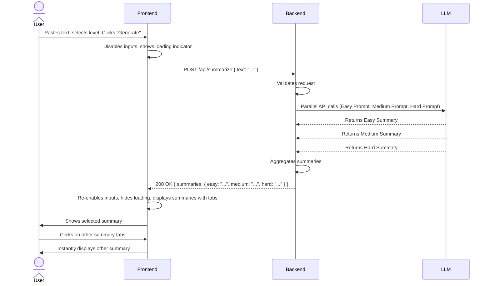

## Core Workflows
### Summarization Request Flow

```mermaid
sequenceDiagram
    actor User
    participant Frontend
    participant Backend
    participant LLM

    User->>Frontend: Pastes text, selects level, Clicks "Generate"
    Frontend->>Frontend: Disables inputs, shows loading indicator
    Frontend->>Backend: POST /api/summarize { text: "..." }
    Backend->>Backend: Validates request
    Backend->>LLM: Parallel API calls (Easy Prompt, Medium Prompt, Hard Prompt)
    LLM-->>Backend: Returns Easy Summary
    LLM-->>Backend: Returns Medium Summary
    LLM-->>Backend: Returns Hard Summary
    Backend->>Backend: Aggregates summaries
    Backend-->>Frontend: 200 OK { summaries: { easy: "...", medium: "...", hard: "..." } }
    Frontend->>Frontend: Re-enables inputs, hides loading, displays summaries with tabs
    Frontend->>User: Shows selected summary
    User->>Frontend: Clicks on other summary tabs
    Frontend->>User: Instantly displays other summary
```