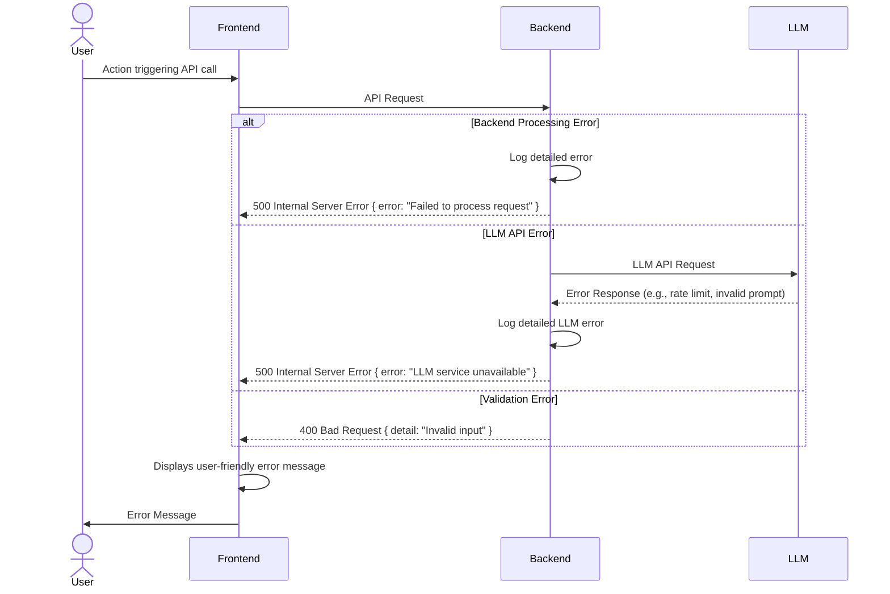

## Error Handling Strategy
### Error Flow


### Error Response Format
```typescript
interface ApiResponseError {
  detail: string;
  // Optional fields for more context, e.g., validation errors
  errors?: Array<{ loc: (string | number)[]; msg: string; type: string }>;
}
// For generic errors, response will be { "detail": "..." }
// For Pydantic validation errors, it will include "errors" field as per FastAPI's default.
```

### Frontend Error Handling
Frontend will catch exceptions from API calls and display user-friendly messages. A global error boundary could be considered for unexpected React errors.

### Backend Error Handling
FastAPI's HTTPException will be used for controlled error responses. Unhandled exceptions will be caught by FastAPI's default handlers, returning a 500 error. Detailed error logging will be implemented using Python's `logging` module.